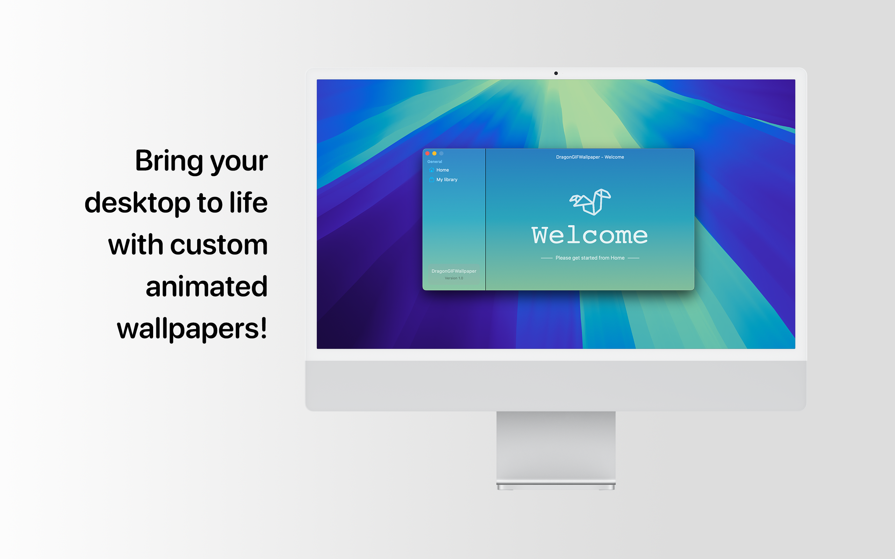
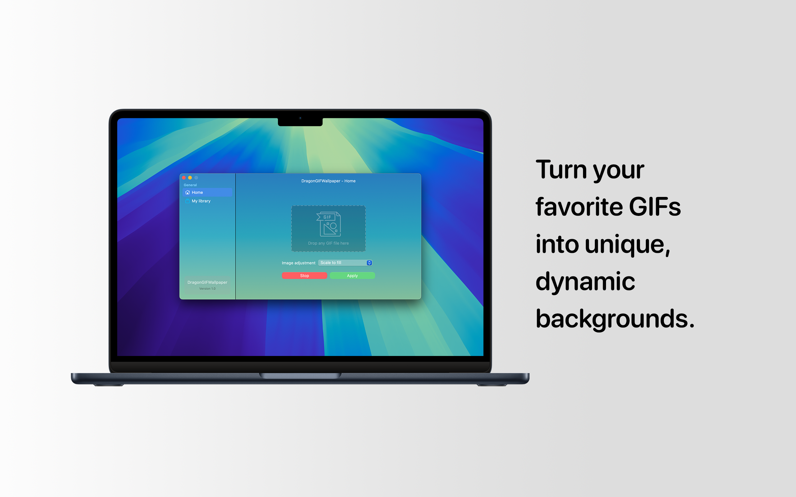
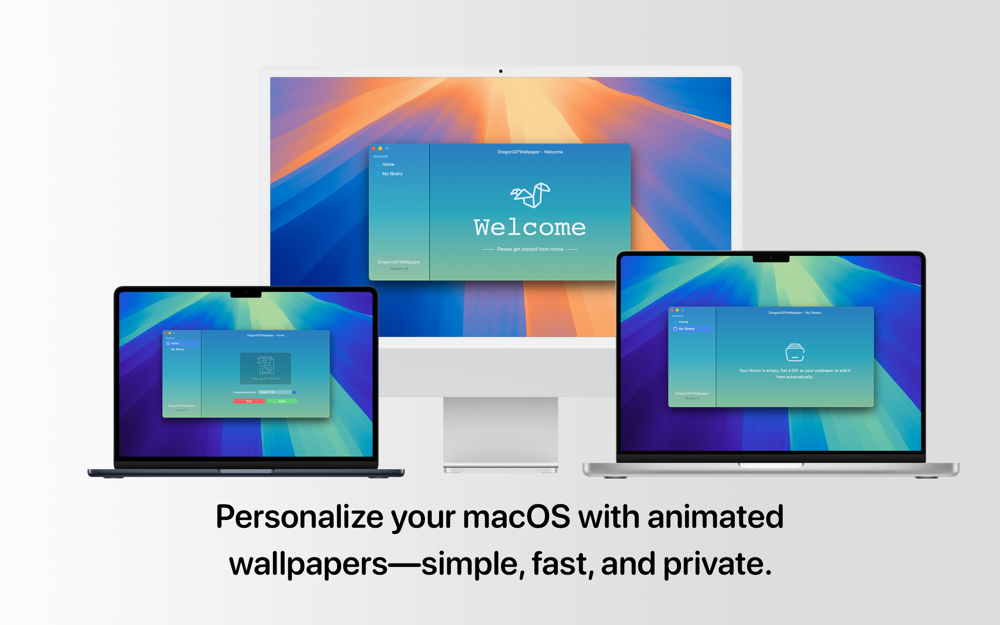

# DragonGIFWallpaper

Transform your macOS desktop with animated GIF wallpapers! DragonGIFWallpaper lets you bring your workspace to life with dynamic, customizable wallpapers while maintaining privacy and top-notch performance.

## Features

- **Custom GIF Wallpapers**: Set any GIF file as your macOS desktop wallpaper.
- **Simple and Intuitive**: Select and apply wallpapers with just a few clicks.
- **Privacy-Focused**: All operations are performed locally on your device—no data collection or sharing.
- **Adjustable Display Options**: Customize how GIFs appear—fill, fit, or center on your screen.
- **Optimized Performance**: Runs smoothly without affecting your system’s performance.

## How to Use

1. Select a GIF file from your local storage.
2. Adjust display settings to suit your preference (e.g., fill, fit, center).
3. Apply the GIF to see your desktop come to life!

## Screenshots

## Installation

### Prerequisites

- macOS 10.13 or later

### Installation Steps

1. [Download](https://github.com/knd8128/dragon-gif-wallpaper/releases) the latest release. 
2. Open the application and follow the on-screen instructions to grant necessary permissions.
3. Start setting your custom animated wallpapers!

## Contributing

Contributions, issues, and feature requests are welcome! Feel free to check the [issues page](https://github.com/knd8128/dragon-gif-wallpaper/issues) if you want to contribute.

## License

This project is licensed under the [MIT License](LICENSE).

## Support

For support or inquiries, please contact [contact@liveratti.com](mailto:contact@liveratti.com).
